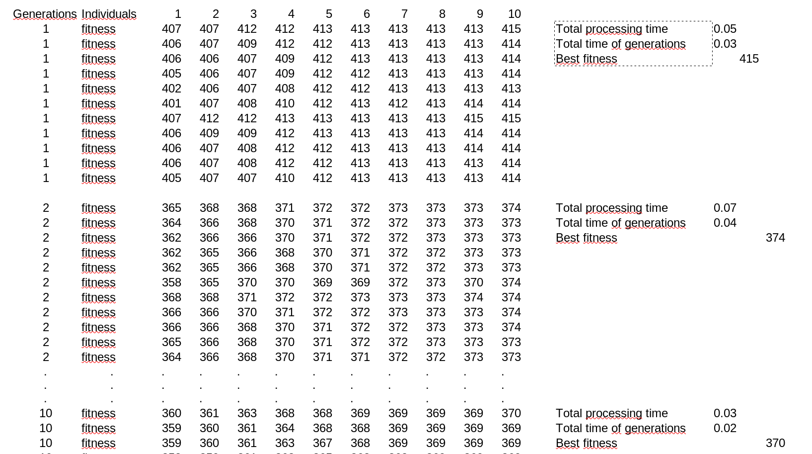

# Genetic Algorithm applied to the Nurse Scheduling Problem

This small project was created to test the knowledge obtained in the course on Metaheuristics for Combinatorial Optimization, offered in the postgraduate program in Computer Science at the State University of Maringá, Brazil.
In the course, the following heuristics were studied:

* [Variable Neighborhood Search](#chen-jiumei-dan-bin-shi-jing-a-variable-neighborhood-search-approach-for-the-multi-compartment-vehicle-routing-problem-with-time-windows-considering-carbon-emission-journal-of-cleaner-production-v-277-p-123932-2020)
* [Ant Colony](#zhang-huizhen-et-al-a-hybrid-ant-colony-optimization-algorithm-for-a-multi-objective-vehicle-routing-problem-with-flexible-time-windows-information-sciences-v-490-p-166-190-2019)
* [GRASP](#yepes-borrero-juan-c-et-al-grasp-algorithm-for-the-unrelated-parallel-machine-scheduling-problem-with-setup-times-and-additional-resources-expert-systems-with-applications-v-141-p-112959-2020)
* [Simulated Annealing](#yin-xunzhao-et-al-ferroelectric-compute-in-memory-annealer-for-combinatorial-optimization-problems-nature-communications-v-15-n-1-p-2419-2024)
* [Genetic Algorithm](#yu-xue-zhou-yuren-liu-xiao-fang-a-novel-hybrid-genetic-algorithm-for-the-location-routing-problem-with-tight-capacity-constraints-applied-soft-computing-v-85-p-105760-2019)

These heuristics were used in seminar presentations where all students selected an article that employed the respective heuristic to use in the mentioned seminar.

## Set of Data

A data set was used to maintain standardization in the tests conducted during the implementation of a heuristic to find the best possible solution for the Nurse Scheduling Problem. This data set was found in the paper "*NSPLib – A Nurse Scheduling Problem Library: A tool to evaluate (meta-)heuristic procedures*" that you can find [here](https://www.projectmanagement.ugent.be/sites/default/files/files/nsp/PaperNSPLib.pdf).  
In this article, you can find the problem instances used in this project. These instances are provided in sets of 25, 50, 75, and 100, where these numbers represent the quantity of nurses. For the project contained in this repository, the problem instances for 25 nurses were considered.  
It is important to note that the set of files considered for the execution of the algorithm contained in this repository has not been included here as it exceeds the allowed size for repository creation. However, they can be found at this [link](https://www.projectmanagement.ugent.be/research/personnel_scheduling/nsp). You you can download the NSPLib benchmark instances in this site. 
Here, the N25 instance was used, which refers to the scheduling problem of 25 nurses.  

The constraint files were used, where the fourth shift is considered the free, non-working shift. The cases from 1 to 8 concern the diverse set of files where the planning horizon is limited to seven days.

## Sources

Some sources was found and used to understand the problem context. They are:

[Hands-on GA with Pythnon](https://github.com/PacktPublishing/Hands-On-Genetic-Algorithms-with-Python/blob/master/Chapter05/02-solve-nurses.py)  
[Solving Nurse Scheduling/Rostering Problems in Python](https://medium.com/@muafirathasnikt/solving-nurse-scheduling-rostering-problems-in-python-d44acc3ed74f)  

In this last one, it is possible to find the repository with the algorithm provided by the author of the article.

## Analysis procedures for the results

Here you will see the procedures adopted to analyze the results generated by the [ga_nurses.py](https://github.com/leonardossrocha/ga-nsp/blob/master/ga_nurses.py) algorithm. It is important to note that the result generated by the algorithm was saved to a file named "resultado.txt". This file became large when setting the number of generations and population size to 100, reaching a size of 123.4 GB. So, to collect the information generated in this file, it was necessary to write another algorithm, also in Python, that performed the task of accessing the result stored in the .txt file and extracted important information for analysis, such as:

* Generation numbers
* Individual numbers
* Fitness value of each individual
* Value of the best fitness found
* Time of each generation
* Total processing time
* Total time of all generations

After that, it was necessary to process the data in a spreadsheet, categorize and sort them so that it was possible to generate the information presented below.

The first one was created with the algorithm executed with the number of generations and population size set to 10. In the second one, this number was changed to 100.Those variables are located on lines 84 and 85 of the algorithm.

**At the end of the execution of 100 generations and 100 populations of individuals, the best individual obtained showed a Fitness of 385, with the processing time of this individual being around 2.90 seconds.**

### Results with variables set to 10

### Results with variables set to 100

### CSV Files

In the repository, you will find all the .csv files created during the procedures described here. They are available:

* [system_usage_before.csv](https://github.com/leonardossrocha/ga-nsp/blob/master/csv_files/system_usage_before.csv) - Created during the execution of the ga_nurses.py algorithm.
* [system_usage_after.csv](https://github.com/leonardossrocha/ga-nsp/blob/master/csv_files/system_usage_after.csv) -  Created before the execution of the ga_nurses.py algorithm
* [extract_results10.csv](https://github.com/leonardossrocha/ga-nsp/blob/master/csv_files/extract_results10.csv) - Raw result file of 10 generations.
* [extract_results10_treated.xls](https://github.com/leonardossrocha/ga-nsp/blob/master/csv_files/extract_results10_treated.xls) - Processed result file of 10 generations
* [extract_results100_treated.xls](https://github.com/leonardossrocha/ga-nsp/blob/master/csv_files/extract_results100_treated.xls) - Processed result file of 100 generations

Unfortunately, it was not possible to host the raw result file of 100 generations, because it exceeded the allowed storage size on this platform.

# REFERENCES

#### [CHEN, Jiumei; DAN, Bin; SHI, Jing. A variable neighborhood search approach for the multi-compartment vehicle routing problem with time windows considering carbon emission. Journal of cleaner production, v. 277, p. 123932, 2020.](https://www.sciencedirect.com/science/article/abs/pii/S0959652620339779)

#### [ZHANG, Huizhen et al. A hybrid ant colony optimization algorithm for a multi-objective vehicle routing problem with flexible time windows. Information Sciences, v. 490, p. 166-190, 2019.](https://www.sciencedirect.com/science/article/abs/pii/S002002551632120X)

#### [YEPES-BORRERO, Juan C. et al. GRASP algorithm for the unrelated parallel machine scheduling problem with setup times and additional resources. Expert Systems with Applications, v. 141, p. 112959, 2020.](https://www.sciencedirect.com/science/article/abs/pii/S0957417419306773)

#### [YIN, Xunzhao et al. Ferroelectric compute-in-memory annealer for combinatorial optimization problems. Nature Communications, v. 15, n. 1, p. 2419, 2024.](https://www.nature.com/articles/s41467-024-46640-x)

#### [YU, Xue; ZHOU, Yuren; LIU, Xiao-Fang. A novel hybrid genetic algorithm for the location routing problem with tight capacity constraints. Applied Soft Computing, v. 85, p. 105760, 2019.](https://www.sciencedirect.com/science/article/abs/pii/S1568494619305411)

